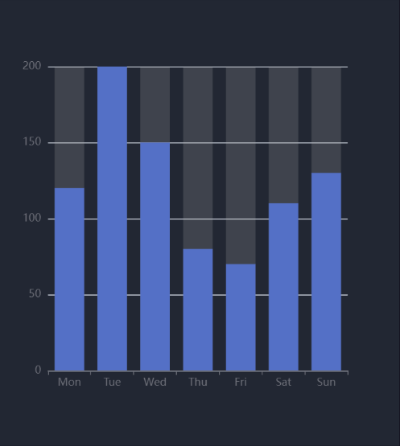
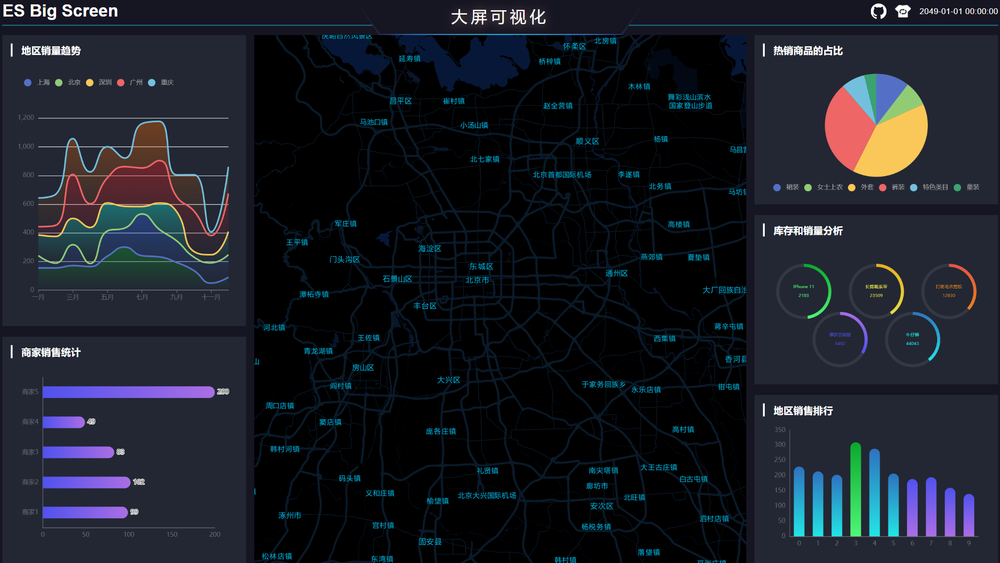

# es-big-screen 大屏可视化项目模板

这是一个基于Vue 3、Echarts、高德地图和Pinia开发的大屏可视化项目，提供了拖拽布局、大屏适配、图表组件(Echarts)封装以及地图组件等功能的封装。

该项目旨在满足大屏项目中常见的需求，并可根据具体需求进行扩展。

拖拽布局使用户能够自由调整组件位置，实现个性化的大屏布局。

图表组件封装利用Echarts强大的数据可视化能力，方便快捷地展示各种图表类型。

高德地图组件则为项目提供了地理数据展示和定制化功能。

整个项目结合了Vue 3的新特性和Pinia状态管理库，提供了优雅、高效的开发体验。无论是大屏适配、图表展示还是拖拽布局，该项目为大屏可视化开发提供了一些基础的解决方案。

可以通过以下链接查看本项目源代码和在线示例，欢迎 star

[源码地址](https://github.com/vangleer/es-big-screen)

[在线示例](https://vangleer.github.io/es-big-screen)

## 主要功能

- 大屏适配
- 图表组件(Echarts)封装
- 高德地图组件封装
- 拖拽布局
- 入场动画
- 无缝滚动

## 文档

[公共组件封装指南](https://juejin.cn/post/7248242431659966522)

[入场动画和无缝滚动](https://juejin.cn/post/7248242431659966522)

## 大屏的适配

大屏适配常用的方案有 `rem + vw/vh` 和 `scale`

rem + vw/vh方案是一种结合使用rem（相对于根元素字体大小的单位）和vw/vh（视窗宽度/高度的单位）来实现大屏的适配。它的优点是灵活性高、兼容性好、适应性强，但需要进行计算，可能存在误差问题，且代码复杂度较高。

另一种是scale方案，它通过改变页面根元素的缩放比例来实现大屏适配。它的优点是实现简单，不需要进行计算，且适用范围广，但可能会存在像素失真问题。

这里我们使用 scale 缩放这种方式来实现

```typescript
// src/utiles/useResize.ts
import { ref, onMounted, onBeforeUnmount } from 'vue'

// 默认适配宽高
export const width = 1920
export const height = 1080

type ResizeType = {
	w?: number
	h?: number
	fullScreen?: boolean
	delay?: number
}

export const useResize = (options: ResizeType = {}) => {
	const {
		w = width,
		h = height,
		fullScreen = false,
		delay = 100
	} = options
	// 缩放元素
	const screenRef = ref()
  const scale = ref(1)
  function resize() {
    // 浏览器宽高
    const clientWidth = document.body.clientWidth
    const clientHeight = document.body.clientHeight

    // 计算宽高缩放比例
		const scaleW = clientWidth / w
		const scaleH = clientHeight / h

    if (clientWidth / clientHeight > w / h) {
			// 如果浏览器的宽高比大于设计稿的宽高比，就取浏览器高度和设计稿高度之比
      scale.value = scaleH
    } else {
			// 如果浏览器的宽高比小于设计稿的宽高比，就取浏览器宽度和设计稿宽度之比
      scale.value = scaleW
    }

		if (fullScreen) {
			// 如果不在乎缩放失真的情况，可以设置全屏
			screenRef.value.style.transform = `scale(${scaleW}, ${scaleH})`
		} else {
			// 否则选择适配比例缩放
			screenRef.value.style.transform = 'scale(' + scale.value + ')'
		}
  }

	const resizeDelay = debounce(resize, delay)
  onMounted(() => {
		if (screenRef.value) {
			resize()
    	window.addEventListener('resize', resizeDelay)
		}
  })

  onBeforeUnmount(() => {
    window.removeEventListener('resize', resizeDelay)
  })

  return {
    scale,
		screenRef
  }
}
```

核心代码在resize函数中

- 首先要确定我们的设计稿尺寸，默认是 `1920 x 1080`
- 分别计算浏览器和设计图宽高比
- 如果浏览器的宽高比大于设计稿的宽高比，就取浏览器高度:设计稿高度，否则取浏览器宽度:设计稿宽度
- 如果想全屏缩放，就分别使用宽高比进行缩放
- 出于对性能的考虑，useResize中使用了防抖，实现如下

```typescript
function debounce(callback, delay) {
	let timerId
	return function (event) {
		// 如果上次事件还没有真正处理, 清除
		if (timerId) {
			clearTimeout(timerId)
		}

		// 发事件发生指定事件后才调用处理事件的回调函数
		// 启动定时器, 只是准备真正处理
		timerId = setTimeout(() => {
			// 正在处理事件
			callback.call(null, event)
			// 删除准备处理的标记
			timerId = null
		}, delay)
	}
}
```

### 使用就非常简单了

将 `useResize` 返回的 screenRef 赋值需要缩放的元素即可

```html

<template>
	<div ref="screenRef"></div>
</template>

<script setup lang='ts'>
import { useResize } from '@/utils/useResize'
const { screenRef } = useResize()
</script>

```

- 效果演示


## echarts 组件封装

### 安装依赖

```sh
yarn add echarts
```

### 封装Char组件

- 按需引入 `src/components/chart/index.ts`

```typescript
import Chart from './Chart.vue'
// Import the echarts core module, which provides the necessary interfaces for using echarts.
import * as echarts from 'echarts/core'

// Import bar charts, all suffixed with Chart
import {
	BarChart,
} from 'echarts/charts'

// Import the tooltip, title, rectangular coordinate system, dataset and transform components
import {
  TitleComponent,
  TooltipComponent,
  GridComponent,
  DatasetComponent,
  TransformComponent
} from 'echarts/components'

// Features like Universal Transition and Label Layout
import { LabelLayout, UniversalTransition } from 'echarts/features'

// Import the Canvas renderer
// Note that including the CanvasRenderer or SVGRenderer is a required step
import { CanvasRenderer } from 'echarts/renderers'
import { App } from 'vue'

export const install = (app: App) => {
	app.component('v-chart', Chart)
}

// Register the required components
echarts.use([
	BarChart,
	TitleComponent,
	TooltipComponent,
	GridComponent,
	DatasetComponent,
	TransformComponent,
	LabelLayout,
	UniversalTransition,
	CanvasRenderer
])

export default {
	install
}

```

- Chart 组件 `src/components/chart/Chart.vue`

```html

<template>
	<div ref="chartRef" className='es-chart'></div>
</template>

<script setup lang='ts'>
import { onMounted, PropType, shallowRef, watch } from 'vue'
import * as echarts from 'echarts'
import { ECharts, EChartsCoreOption } from 'echarts'

const props = defineProps({
	option: {
		type: Object as PropType<EChartsCoreOption>,
		required: true,
		default: () => ({})
	},
	loading: Boolean
})
const chartRef = shallowRef<HTMLElement | null>(null)

const chart = shallowRef<ECharts | null>(null)
function init() {
	if (props.option) {
		chart.value = echarts.init(chartRef.value!)
		setOption(props.option)
	}
}
function setOption(option, notMerge?: boolean, lazyUpdate?: boolean) {
	chart.value!.setOption(option, notMerge, lazyUpdate)
}

function resize() {
	chart.value!.resize()
}

watch(() => props.option, () => {
	setOption(props.option)
})

// show loading
watch(() => props.loading, (val) => {
	if (!chart.value) return
	if (val) {
		chart.value!.showLoading()
	} else {
		chart.value!.hideLoading()
	}
})

onMounted(() => {
	init()
})

defineExpose({
	chart,
	setOption,
	resize
})
</script>

<style lang='scss' scoped>
.es-chart {
	width: 100%;
	height: 100%;
}
</style>
```

- 注册组件 `src/main.ts`

```typescript

import { createApp } from 'vue'
import App from './App.vue'
import * as chart from './components/chart'
createApp(App).use(chart).mount('#app')

```

```html

<template>
	<v-chart ref="chartRef" :option="option" />
</template>

<script setup lang='ts'>
import { ref } from 'vue'
const chartRef = ref()
const option = ref({
  xAxis: {
    type: 'category',
    data: ['Mon', 'Tue', 'Wed', 'Thu', 'Fri', 'Sat', 'Sun']
  },
  yAxis: {
    type: 'value'
  },
  series: [
    {
      data: [120, 200, 150, 80, 70, 110, 130],
      type: 'bar',
      showBackground: true,
      backgroundStyle: {
        color: 'rgba(180, 180, 180, 0.2)'
      }
    }
  ]
})
</script>

```



上面只是对echarts的简单封装，当组件挂载后我们可以使用 `chartRef.value.chart` echarts的实例，完成一些复杂的功能


## 组件的拖拽

这里我们使用了 SortableJS 来实现拖拽

SortableJS是一个强大的JavaScript库，用于创建可排序、可拖放和可交互的列表。它提供了一种简单的方法来实现拖放排序功能，使用户可以通过拖动列表项来重新排序它们。

### 安装依赖

```sh
yarn add sortablejs
```

### 封装useSortable

```typescript
// src/utils/useSortable.ts

import { ref, onMounted, Ref } from 'vue'
import Sortable from 'sortablejs'

export const useSortable = (listRef: Ref<any[]>) => {

	// 容器元素
	const containerRef = ref()

	onMounted(() => {
		Sortable.create(containerRef.value!, {
			swapThreshold: 1,
			animation: 150,
			onUpdate(e) {
				const item = listRef.value[e.oldIndex]
				listRef.value.splice(e.oldIndex, 1)
				listRef.value.splice(e.newIndex, 0, item)
			}
		})
	})

	return {
		containerRef
	}
}

```

### 使用方式

```html
<template>
	<div ref="containerRef">
		<component
			v-for="item in components"
			:key="item.name"
			:is="item.component"
			class="es-screen-right-item"
		>
			{{ item.name }}
		</component>
	</div>
</template>

<script setup lang='ts'>
import { shallowRef } from 'vue'
import { useSortable } from '@/utils/useSortable'
import Right1 from './Right1.vue'
import Right2 from './Right2.vue'
import Right3 from './Right3.vue'
const components = shallowRef([
	{ name: 'right1', component: Right1 },
	{ name: 'right2', component: Right2 },
	{ name: 'right3', component: Right3 }
])

const { containerRef } = useSortable(components)
</script>

<style lang='scss' scoped>
.es-screen-right-item {
	width: 100%;
	height: 300px;
	background-color: var(--es-block-bg);
	padding: 16px;
	& + & {
		margin-top: 20px;
	}
}
</style>

```

useSortable 会返回父元素的ref将其挂载到列表标签上即可，如果希望列表数据也交换需要将列表传入到函数中

效果演示


## 地图封装 AMap

[高德地图 JS API 2.0](https://lbs.amap.com/api/jsapi-v2)

在开发大屏项目时可能也会遇到地图相关的需求，这就需要使用原生的地图，这里使用的是高德地图

使用前需要注册开发者账号，申请API Key，服务平台选择 `Web端(JS API)`

### 安装依赖

```sh

yarn add @amap/amap-jsapi-loader
yarn add @amap/amap-jsapi-types -D

```

### vue 组件

```html
<template>
	<div id="mapContainer"></div>
</template>

<script setup lang='ts'>
import { onMounted, shallowRef } from 'vue'
import '@amap/amap-jsapi-types'
import AMapLoader from '@amap/amap-jsapi-loader'

const map = shallowRef<AMap.Map | null>(null)

function initMap() {
  AMapLoader.load({
		key: '', // 申请好的Web端开发者Key，首次调用 load 时必填
		version: '2.0', // 指定要加载的 JSAPI 的版本，缺省时默认为 1.4.15
		plugins: [], // 需要使用的的插件列表，如比例尺'AMap.Scale'等
	}).then((MyAMap: typeof AMap)=>{
		map.value = new MyAMap.Map('mapContainer',{
			mapStyle: 'amap://styles/darkblue'
		})
	}).catch(e=>{
		console.log(e);
	})
}

onMounted(() => {
	initMap()
})

defineExpose({
	map
})
</script>

<style lang='scss'>
#mapContainer {
	width: 100%;
	height: 100%;
}
.amap-logo, .amap-copyright {
	opacity: 0;
}
</style>

```



因为直接选用的是AMap默认支持的主题，样式有点不协调(●'◡'●)，不过我们可以按照设计图要求去官网自定义主题

